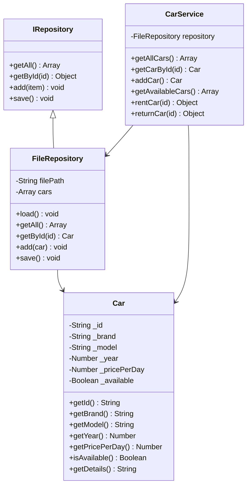

# Class Diagram - Rent a Car

```mermaid
classDiagram
    class Car {
        -String _id
        -String _brand
        -String _model
        -Number _year
        -Number _pricePerDay
        -Boolean _available
        +getId() String
        +getBrand() String
        +getModel() String
        +getYear() Number
        +getPricePerDay() Number
        +isAvailable() Boolean
        +getDetails() String
    }

    class IRepository {
        +getAll() Array
        +getById(id) Object
        +add(item) void
        +save() void
    }

    class FileRepository {
        -String filePath
        -Array cars
        +load() void
        +getAll() Array
        +getById(id) Car
        +add(car) void
        +save() void
    }

    class CarService {
        -FileRepository repository
        +getAllCars() Array
        +getCarById(id) Car
        +addCar() Car
        +getAvailableCars() Array
        +rentCar(id) Object
        +returnCar(id) Object
    }

    IRepository <|-- FileRepository
    FileRepository --> Car
    CarService --> FileRepository
    CarService --> Car
```